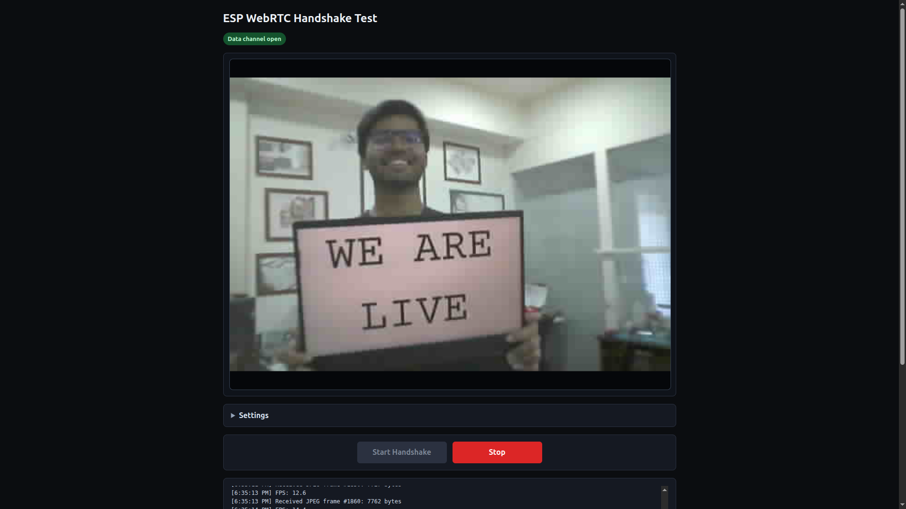
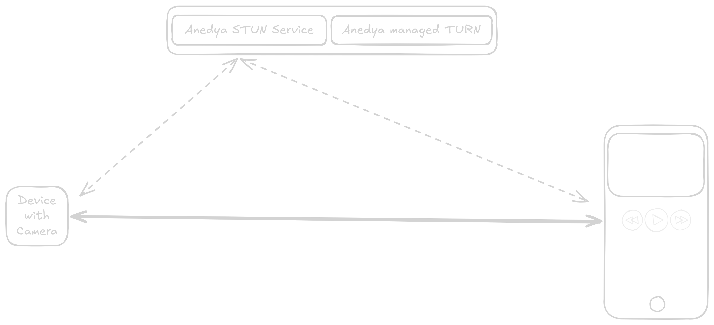
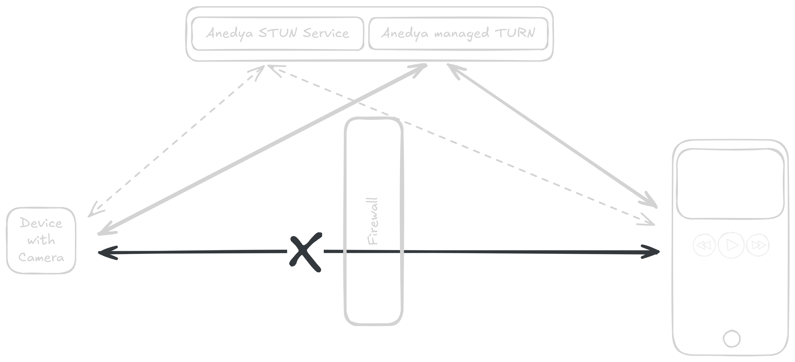

[](https://docs.anedya.io?utm_source=github&utm_medium=link&utm_campaign=github-examples&utm_content=esp-cam)


<p align="center">
    
</p>

# ESP32- WebRTC Camera Livestream with Anedya



Turn an ESP32-Camera board into a real-time camera livestream device with Anedya (Commands and TURN relay).

## ✨ Features

- **Signaling :** SDP offer/answer and ICE candidates exchanged via MQTT, no custom signaling server needed
- **TURN Relay :** TURN server provided by Anedya to relay media streams.
- **Live-Remote Video streaming :** Camera frames sent over WebRTC DataChannel. [View Here](https://anedyaio.github.io/anedya-camera-livestream-example-esp32/)
<!-- - **Realtime Audio Support :** Support for audio streaming over WebRTC DataChannel. -->

---

## 📷 Anedya - Camera Board Support

| Board | Support Status  | Product Link |
|---|---|--|--|
| ESP32-CAM | Supported | [Link](https://vdoc.ai-thinker.com/en/esp32-cam) |
| DFRobot ESP32-S3 AI Camera | Supported | [Link](https://www.dfrobot.com/product-2899.html) |
| Seed Studio XIAO ESP32S3 Sense | Supported | [Link](https://www.seeedstudio.com/XIAO-ESP32S3-Sense-p-5639.html) |

---

## 🏗 How It Works

### Signaling via Anedya Commands + MQTT

WebRTC requires both peers to exchange SDP offers and answers before media can flow. This example uses Anedya Commands as a signaling channel and Anedya MQTT as the notification mechanism.

```
Browser Viewer
  │  1. Fetch TURN credentials (Anedya REST API)
  │  2. Create WebRTC offer to Commands (JSON with SDP + TURN creds)
  ▼
Anedya Cloud  (Commands + MQTT broker + TURN relay)
  │  3. Notify ESP32 over MQTT subscription
  ▼
ESP32-CAM
  │  4. Parse offer, extract SDP + TURN credentials
  │  5. Create WebRTC answer ackowledgement to Commands
  ▼
Browser Viewer
  │  6. Poll Commands status → read answer ackowledgement → apply remote description
  │  7. ICE negotiation completes
  │  8. JPEG frames flow over WebRTC DataChannel → rendered in 
```

### WebRTC Connectivity

When both peers are on the same network, ICE resolves a direct path using STUN address discovery:

<p align="center">
    
</p>

When a firewall blocks direct peer-to-peer traffic, Anedya's managed TURN relay is used automatically:

<p align="center">
    
</p>

### JPEG over DataChannel

This project does not use WebRTC RTP video tracks. Instead, camera JPEG frames are sent as binary messages over a WebRTC DataChannel labeled `jpeg-test`. The browser receives each frame and updates an `` element. This approach is intentionally simple and easy to inspect in both C and JavaScript, a useful starting point for understanding WebRTC on embedded devices.

---

## 📁 Repository Layout

```
.
├── main/
│   ├── app_main.c          — camera init, JPEG stream task, FreeRTOS entry
│   ├── anedya_sig.c        — Anedya MQTT client, Commands-based signaling
│   ├── webrtc_peer.c       — esp_peer WebRTC peer, DataChannel send pipeline
│   ├── boards.h            — camera pin maps (XIAO ESP32S3 Sense, AI Thinker ESP32-CAM)
│   ├── Kconfig.projbuild   — menuconfig: Device ID, Connection Key, camera, test mode
│   └── idf_component.yml   — IDF component dependencies
├── components/
│   └── anedya__anedya-esp/ — Anedya ESP-IDF SDK
└── managed_components/     — espressif/esp32-camera, espressif/esp_peer, etc.
```

---

## 🚀 Getting Started

### What You Need

**Hardware** (either board)
- Seeed Studio XIAO ESP32S3 Sense (built-in OV2640 camera, native USB — no programmer needed), or
- AI Thinker ESP32-CAM (OV2640 or OV3660 camera module) + USB-to-serial programmer (e.g. FTDI, CP2102)

**Software / Accounts**
- [ESP-IDF](https://docs.espressif.com/projects/esp-idf/en/latest/esp32/get-started/) v5.4.0 or later
- An [Anedya](https://anedya.io?utm_source=github&utm_medium=link&utm_campaign=github-examples&utm_content=esp-cam) account

---

### Step 1: Create Your Anedya Project

1. Sign in at [Anedya Console](https://accounts.anedya.io/ui/login).
2. Create a new project.
3. Create a node for your ESP32-CAM and pre-authorize it with a UUID.
4. Note down these values, you will need them in Step 3:

| Value | Where to find it |
|---|---|
| `ANEDYA_DEVICE_ID` | Node details → Device ID |
| `ANEDYA_NODE_ID` | Node details → Node ID |
| `ANEDYA_CONNECTION_KEY` | Node details → Connection Key |

5. Generate a **Platform API key** for the browser viewer.

> [!TIP]
> See [Anedya Project Setup](https://docs.anedya.io/getting-started/project-setup/) for a step-by-step walkthrough of the console.

---

### Step 2: Clone the Repository

```bash
git clone https://github.com/anedyaio/anedya-camera-livestream-example-esp32
cd anedya-camera-livestream-example-esp32
cd anedya-livestream-example-esp32-cam
```

---

### Step 3: Configure the Firmware

Run menuconfig and fill in **Anedya WebRTC Camera**:

```bash
idf.py menuconfig
```

| Config key | Where to find it | Value | 
|---|---|--|
| `ANEDYA_DEVICE_ID` | Anedya console → Device → Settings | <YOUR_DEVICE_ID> |
| `ANEDYA_CONNECTION_KEY` | Anedya console → Device → Connection Key | <YOUR_CONNECTION_KEY> |
| `Camera board` | Camera Settings -> Camera Board  | Board you are using |
| `Support DTLS protocol (all versions)` | Component config -> mbedtls | Enable |
| `CONFIG_MBEDTLS_SSL_DTLS_SRTP` | Component config->mbedTLS->mbedTLS v3.x related->DTLS-based configurations  | Enable |
| `PARTITION_TABLE_TYPE` | Partition Table -> Partition Table  | Custome Partition table csv |


Also configure WiFi credentials under **Example Connection Configuration**.

> [!IMPORTANT]
> PSRAM and flash size are preconfigured per board by `sdkconfig.defaults.esp32s3`
> (XIAO: 8 MB flash, octal PSRAM) and `sdkconfig.defaults.esp32` (AI Thinker: 4 MB
> flash, quad PSRAM). Without PSRAM, camera frame buffer allocation fails
> (~266 KB DRAM is not enough).

---

### Step 4: Build & Flash

The build target selects the board — the camera pin map and PSRAM/flash
settings follow it automatically.

**Seeed XIAO ESP32S3 Sense:**

```bash
idf.py set-target esp32s3
idf.py build
idf.py -p /dev/ttyUSB0 flash monitor
```
**DFrobot ESP32-S3 AI Camera:**

```bash
idf.py set-target esp32s3
idf.py build
idf.py -p /dev/ttyUSB0 flash monitor
```

**AI Thinker ESP32-CAM:**

```bash
idf.py set-target esp32
idf.py build
idf.py -p /dev/ttyUSB0 flash monitor
```

---

### Step 5: Connect a Viewer

Open the browser viewer (included in the companion viewer repository or hosted version), then:

1. Click **Settings**
2. Enter your **Node ID** and **Platform API key**
3. Click **Start Stream**

The viewer fetches TURN credentials from Anedya, writes an offer to ValueStore, and waits for the ESP32 to answer. Once the DataChannel opens, JPEG frames appear in the browser.

---

## 🎛 Camera Stream Settings

The default profile targets balanced quality at 20 FPS:

| Setting | Value |
|---|---|
| Frame size | HVGA (480 × 320) |
| JPEG quality | 25 |
| Frame buffer count | 2 |
| Target FPS | 20 |

A max-FPS / lower-quality preset is documented in comments in [main/app_main.c](main/app_main.c):

```c
#define CAMERA_STREAM_FRAME_SIZE   FRAMESIZE_QVGA
#define CAMERA_STREAM_JPEG_QUALITY 20
#define CAMERA_STREAM_FB_COUNT     3
#define CAMERA_STREAM_GRAB_MODE    CAMERA_GRAB_LATEST
```

---

## 🔌 DataChannel Test Mode

Enable `CONFIG_DATACHANNEL_TEST_MODE` in menuconfig to skip camera init entirely and instead send a counter message (`ping NNN from esp32`) over the DataChannel at a configurable interval. Use this to verify WebRTC signaling and DataChannel connectivity without a working camera.

---


---

## 📚 References

**Anedya**
- [Anedya Overview](https://docs.anedya.io/anedya-overview/)
- [Anedya Concepts](https://docs.anedya.io/essentials/concepts/)
- [Anedya Project Setup](https://docs.anedya.io/getting-started/project-setup/)
- [Anedya MQTT Endpoints](https://docs.anedya.io/device/mqtt-endpoints/)
- [Anedya Commands](https://docs.anedya.io/features/commands/commands-intro/)
- [Anedya Platform API](https://docs.anedya.io/platform-api/)
- [Anedya ESP-IDF SDK](https://components.espressif.com/components/anedya/anedya-esp/versions/0.0.15/readme)

**WebRTC & ESP-IDF**
- [WebRTC Overview](https://webrtc.org/getting-started/overview)
- [WebRTC Peer Connections](https://webrtc.org/getting-started/peer-connections)
- [espressif/esp_peer](https://components.espressif.com/components/espressif/esp_peer)
- [espressif/esp32-camera](https://components.espressif.com/components/espressif/esp32-camera)
- [ESP-IDF Getting Started](https://docs.espressif.com/projects/esp-idf/en/latest/esp32/get-started/)

**Looking for other examples**

- [Anedya Camera Livestream with Raspberry Pi](https://github.com/anedyaio/anedya-camera-livestream-example)

---


## License

This project is licensed under the [MIT](LICENSE).
