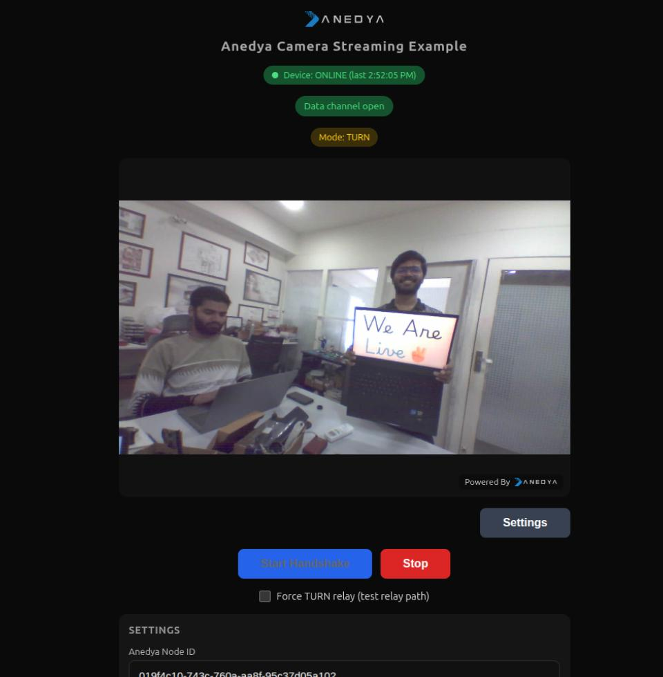
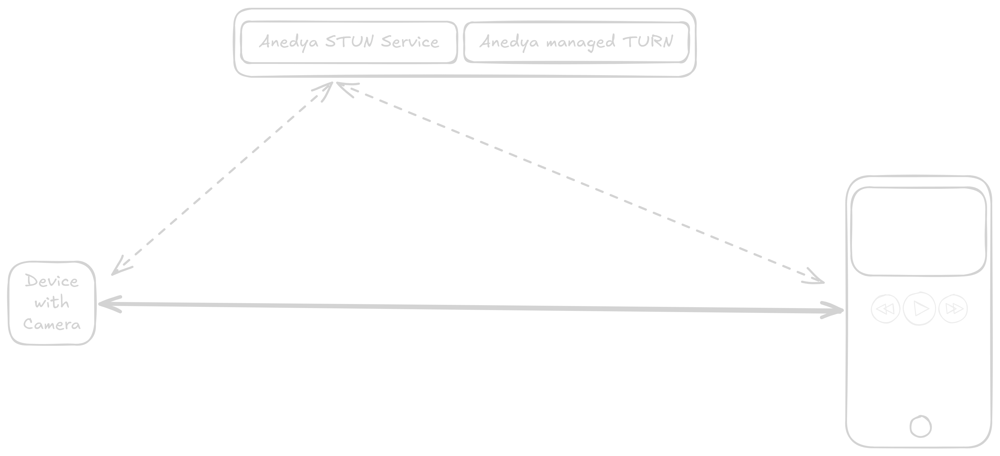
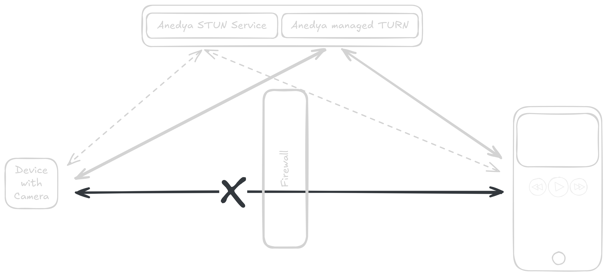

[](https://docs.anedya.io?utm_source=github&utm_medium=link&utm_campaign=github-examples&utm_content=esp-cam)
[](https://anedyaio.github.io/anedya-camera-livestream-example-esp32/)


<p align="center">
    
</p>

# ESP32- WebRTC Camera Livestream with Anedya



Turn an ESP32-Camera board into a real-time camera livestream device with Anedya (Commands and TURN relay).
 
## ✨ Features

- **Signaling :** SDP offer/answer and ICE candidates exchanged via MQTT, no custom signaling server needed
- **Peer to Peer with turn relay fallback :** Direct connection with webrtc with relay fallback of Anedya TURN server.
- **Live-Remote Video streaming :** Camera frames sent over WebRTC DataChannel. [View Here](https://anedyaio.github.io/anedya-camera-livestream-example-esp32/)
<!-- - **TURN Relay :** TURN server provided by Anedya to relay media streams. -->
<!-- - **Realtime Audio Support :** Support for audio streaming over WebRTC DataChannel. -->
---

## Supported Development Environments - Examples

| Framework / Platform | Status |
|---|---|
| ESP-IDF | [Available](./ESP-IDF/) |
| PlatformIO (Ardiuno) | [Available](./Platformio/) |

---

## 📷 Anedya - Camera Board Support

| Board | Support Status | Product Link |
|---|---|--|
| ESP32-CAM | Supported | [Link](https://vdoc.ai-thinker.com/en/esp32-cam) |
| DFRobot ESP32-S3 AI Camera | Supported | [Link](https://www.dfrobot.com/product-2899.html) |
| Seed Studio XIAO ESP32S3 Sense | Supported | [Link](https://www.seeedstudio.com/XIAO-ESP32S3-Sense-p-5639.html) |

---


## 📁 Repository Layout

```
  |──ESP-IDF
  |  ├── main/
  |  │   ├── app_main.c          — camera init, JPEG stream task, FreeRTOS entry
  |  │   ├── anedya_sig.c        — Anedya MQTT client, Commands-based signaling
  |  │   ├── webrtc_peer.c       — esp_peer WebRTC peer, DataChannel send pipeline
  |  │   ├── boards.h            — camera pin maps (XIAO ESP32S3 Sense, AI Thinker ESP32-CAM)
  |  │   ├── Kconfig.projbuild   — menuconfig: Device ID, Connection Key, camera, test mode
  |  │   └── idf_component.yml   — IDF component dependencies
  |  ├── components/
  |  │   └── anedya__anedya-esp/ — Anedya ESP-IDF SDK
  |  └── managed_components/     — espressif/esp32-camera, espressif/esp_peer, etc.
  |
  |──Platformio
     ├── platformio.ini             — PlatformIO configuration, one [env:] per board
     ├── sdkconfig.defaults         — Base ESP-IDF configuration (DTLS-SRTP, etc.)
     ├── sdkconfig.defaults.*       — Board-specific configs (PSRAM mode, Flash size)
     ├── partitions.csv             — Custom partition tables for the heavy WebRTC stack
     ├── include/
     │   ├── app_config.h           — ★ WiFi + Anedya credentials + all tuning
     │   ├── camera_pins.h          — Camera pin maps
     │   ├── anedya_signaling.h     
     │   └── webrtc_peer.h
     ├── src/
     │   ├── idf_component.yml      — Component manager (esp_peer, esp32-camera)
     │   ├── main.cpp               — setup()/loop(): camera capture + MQTT
     │   ├── anedya_signaling.cpp   — MQTT signaling
     │   └── webrtc_peer.cpp        — WebRTC peer connection logic
     └── test-peer/
         └── index.html             — Browser viewer (open directly, no server needed)
  ```


---

## 🏗 How It Works

### Signaling via Anedya Commands + MQTT

WebRTC requires both peers to exchange SDP offers and answers before media can flow. This example uses Anedya Commands as a signaling channel and Anedya MQTT as the notification mechanism.

```
Browser Viewer
  │  1. Fetch TURN credentials (Anedya REST API)
  │  2. Create WebRTC offer to Commands (JSON with SDP + TURN creds)
  ▼
Anedya Cloud  (Commands + MQTT broker + TURN relay)
  │  3. Notify ESP32 over MQTT subscription
  ▼
ESP32-CAM
  │  4. Parse offer, extract SDP + TURN credentials
  │  5. Create WebRTC answer ackowledgement to Commands
  ▼
Browser Viewer
  │  6. Poll Commands status → read answer ackowledgement → apply remote description
  │  7. ICE negotiation completes
  │  8. JPEG frames flow over WebRTC DataChannel → rendered in 
```

### WebRTC Connectivity

When both peers are on the same network, ICE resolves a direct path using STUN address discovery:

<p align="center">
    
</p>

When a firewall blocks direct peer-to-peer traffic, Anedya's managed TURN relay is used automatically:

<p align="center">
    
</p>

### JPEG over DataChannel

This project does not use WebRTC RTP video tracks. Instead, camera JPEG frames are sent as binary messages over a WebRTC DataChannel labeled `jpeg-test`. The browser receives each frame and updates an `` element. This approach is intentionally simple and easy to inspect in both C and JavaScript, a useful starting point for understanding WebRTC on embedded devices.

---

## 📚 References

**Anedya**
- [Anedya Overview](https://docs.anedya.io/anedya-overview/)
- [Anedya Concepts](https://docs.anedya.io/essentials/concepts/)
- [Anedya Project Setup](https://docs.anedya.io/getting-started/project-setup/)
- [Anedya MQTT Endpoints](https://docs.anedya.io/device/mqtt-endpoints/)
- [Anedya Commands](https://docs.anedya.io/features/commands/commands-intro/)
- [Anedya Platform API](https://docs.anedya.io/platform-api/)
- [Anedya ESP-IDF SDK](https://components.espressif.com/components/anedya/anedya-esp/versions/0.0.15/readme)

**WebRTC & ESP-IDF**
- [WebRTC Overview](https://webrtc.org/getting-started/overview)
- [WebRTC Peer Connections](https://webrtc.org/getting-started/peer-connections)
- [espressif/esp_peer](https://components.espressif.com/components/espressif/esp_peer)
- [espressif/esp32-camera](https://components.espressif.com/components/espressif/esp32-camera)
- [ESP-IDF Getting Started](https://docs.espressif.com/projects/esp-idf/en/latest/esp32/get-started/)

---

## 📑 Looking for other examples

#### @ [Anedya Camera Livestream with Raspberry Pi](https://github.com/anedyaio/anedya-camera-livestream-example)
